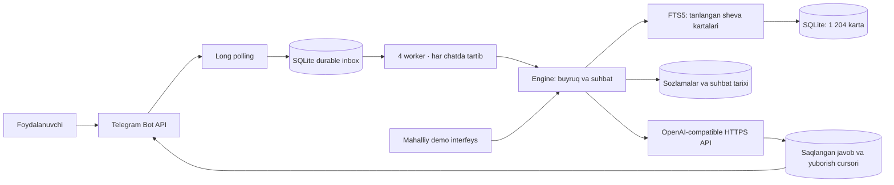

# Arxitektura

Eshqo‘zi Telegramdagi shaxsiy chatda hudud va ohangga mos javob beradi. Kodning markazi `Engine`: Telegram va mahalliy sinov interfeysi bir xil tanlov, manba, tarix va o‘chirish mantiqidan foydalanadi.

## Texnologiya tanlovi

Python 3.12 va FastAPI boshqaruv/holat interfeysi uchun; HTTPX tashqi HTTPS so‘rovlar uchun. Telegram uchun alohida SDK talab qilinmaydi: ishlatiladigan Bot API metodlari kichik adapterda. OpenAI Chat Completions ham adapter orqali, provider almashtirish `Engine`ni o‘zgartirmaydi.

SQLite WAL bitta serverdagi boshlang‘ich bot uchun tanlandi. Diskdagi navbat va FTS5 mavjud; Redis yoki vektor xizmatini ishga tushirish majburiy emas. 1 204 kartani leksik qidirish tez va natijasi kuzatiladigan. SQLite yozuvlari qisqa tranzaksiyalar; tashqi HTTP kutish vaqtida baza qulfi ushlab turilmaydi. Fayl bazasi lokal persistent volume’da bo‘lishi kerak, tarmoq fayl tizimida emas.

Serverni gorizontal ko‘paytirishdan oldin storage adapter PostgreSQLga, navbat lease’lari ko‘p instance’ga mos tarzda ko‘chiriladi. Hozir bitta volume uchun bitta poller jarayoni va 4 worker qo‘llanadi. Ko‘p Uvicorn worker yoki `--reload` production rejimida ishlatilmaydi.

## Ma’lumotlar modeli

| Jadval | Saqlanadigan ma’lumot |
|---|---|
| `schema_migrations` | Baza sxemasi versiyasi va qo‘llangan vaqt. |
| `profiles` | 13 tanlanadigan sheva/uslub profili. |
| `cards`, `cards_fts` | Shakl, ma’no, hududiy chegara, izoh, manba va qidiruv matni. |
| `users` | Chat ID, tanlangan sheva, ohang va vaqtlar. Ism/telefon talab qilinmaydi. |
| `turns` | Savol-javob jufti va javobga tayanch qilib berilgan kartalar. |
| `feedback` | O‘z javobiga 👍/👎; boshqa chat javobini baholash bloklanadi. |
| `inbox` | Update ID, qayta ishlash holati, qisqa event, javob, cursor va retry vaqti. |
| `usage` | Har chat uchun yaqindagi yangi AI savollarining sanog‘i. |
| `metadata` | Polling offset, bilim bazasi xeshi va shaxssiz kunlik AI urinishlar budjeti. |

SQLite foreign keylar yoqilgan; tarix va feedback foydalanuvchi o‘chirilganda kaskad o‘chadi. Migratsiya birinchi versiyani tranzaksiyada yaratadi. Noma’lum yangi sxemaga eski kod bilan ulanish rad etiladi. Bilim bazasi xeshi o‘zgarmasa qayta import qilinmaydi; o‘zgarsa kartalar va FTS indeks tranzaksiyada yangilanadi.

## Telegram update hayoti

1. `getUpdates` offset bilan xabarlarni oladi. Faqat shaxsiy chat va o‘sha chatga tegishli sender qabul qilinadi.
2. Yangi update’lar va offset **bitta tranzaksiyada** yoziladi. Keyin Telegramga keyingi offset bilan murojaat qilinadi. Guruh/media kabi qo‘llanmaydigan update’lar pollingni to‘xtatmaydi.
3. Worker lease bilan job oladi. Bitta chatning oldingi job’i queued/running bo‘lsa keyingisi olinmaydi; boshqa chat parallel ishlaydi.
4. `Engine` buyruqni bajaradi yoki quota → profil → qidiruv → tarix → AI yo‘lidan o‘tadi.
5. Javob va tarix yetkazishdan oldin tranzaksiyada saqlanadi. Har yuborilgan bo‘lakdan keyin cursor yangilanadi.
6. Muvaffaqiyatdan keyin inbox’dagi matn va javob tozalanadi. 429/5xx/transport xatosi kechiktirilgan qayta urinishga yuboriladi. Shaxsiy matn va tokenlar logga yozilmaydi.

Yaratish va yetkazish uchun 5 tadan urinish; shutdownda running job queued holatiga qaytariladi. Restartda yagona jarayon qulfi olingach qolgan running job’lar tiklanadi. JavaScript sahifasi yoki HTTP API Telegramga o‘zboshimchalik bilan xabar yubormaydi; demo faqat o‘z seansi bilan ishlaydi.

Telegram `sendMessage` idempotency kalitini bermaydi. Xabar Telegramda qabul qilinib, HTTP javobi yo‘qolsa yoki cursor yozilishidan oldin process uzilsa, ayni bo‘lak takror yuborilishi mumkin. Ushbu loyiha buni “exactly once” deb da’vo qilmaydi. Saqlangan cursor odatdagi retry va restartda oldingi bo‘laklarni qaytarmaydi; saqlangan AI javobi delivery retry’da qayta generatsiya qilinmaydi.

## Javobni yaratish

Profil va ohang boshqariladigan system kontekstida; so‘z, ma’no, hudud va izohlar buyruq bo‘lmagan JSON ma’lumoti sifatida beriladi. So‘rov lotin/kirill, apostrof va diakritikalar bo‘yicha qidiruv uchun normallashtiriladi. FTS so‘rovi foydalanuvchining operator matnidan tuzilmaydi, tokenlar qo‘shtirnoq bilan xavfsiz yig‘iladi.

Qidiruv faqat tanlangan hududda. Ko‘cha profili o‘z kartalari va o‘sha hududning grammatik asosini oladi. Sinonim/omonim kartalar birlashtirib yo‘qotilmaydi. Mos leksik kartalar, cheklangan grammatika va kundalik muomala tayanchlari beriladi. To‘liq fonetik harf almashtirish qoidasi qo‘llanmaydi.

`/manba` oxirgi javobga **berilgan** sheva dalillarini ko‘rsatadi. Bu model haqiqatda har kartani ishlatgani yoki har bir umumiy fakt shu kitob bilan isbotlangani degani emas. Barcha gapning native tabiiyligi avtomatik kafolatlanmaydi.

## Limit va maxfiylik

Standart limitlar: 4 000 belgi kirish, 8 yangi savol/minut/chat, 100 savol/kun/chat, umumiy 2 000 AI chaqiruv urinish/UTC kun. AI retry ham umumiy budjetga kiradi; yetkazish retry kirmaydi. Javob `max_tokens=900` bilan cheklangan va Telegramga UTF-16 hisobida xavfsiz bo‘laklanadi.

Har chatda ko‘pi bilan 6 savol-javob, 72 soatlik TTL. `/clear` tarix va unga bog‘liq feedbackni o‘chiradi, profilni saqlaydi. `/forget` sozlama, tarix, feedback, chat usage’i va pending xabarlarni o‘chiradi; shu buyruqni yetkazish record’i yakunda olib tashlanadi. Shaxssiz umumiy budjet qoladi. Tayyor backup ichidagi oldingi ma’lumotlar avtomatik yo‘qolmaydi; backup retention operator zimmasida.

Telegram matni AI xizmatiga yuborilishi `/start`da aytiladi. Tokenlar environment’dan olinadi, Settings repr’iga va logga kirmaydi. Tashqi URLlar faqat operator HTTPS sozlamasidan olinadi; foydalanuvchi matni tashqi HTTP manziliga aylantirilmaydi. Modelga hech qanday shell yoki tashqi action vositasi berilmaydi.
